# Image Processing Simulator Using NumPy

## Overview

This project is a beginner-level exploration of fundamental image processing operations using NumPy. A synthetic grayscale image was represented as a 2D NumPy array, and several common image processing techniques were implemented manually to better understand how images can be manipulated mathematically.

The goal of the project was not to build a production-ready image processing system, but to gain hands-on experience with array operations, slicing, broadcasting, neighborhood-based processing, and basic computer vision concepts.

---

## Project Tasks and Their Significance

### 1. Synthetic Image Generation

A 64×64 grayscale image was generated using random pixel intensities.

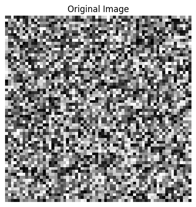

**Purpose:**

* Provides a controlled environment for experimentation.
* Helps understand that digital images are fundamentally matrices of numbers.

**Industry Perspective:**
Real-world applications typically work with images acquired from cameras, scanners, satellites, medical devices, etc. Synthetic images are mostly used for testing, simulation, and algorithm development.

---

### 2. Brightness Adjustment

A scalar value was added to all pixels, followed by clipping values to the valid range [0, 255].

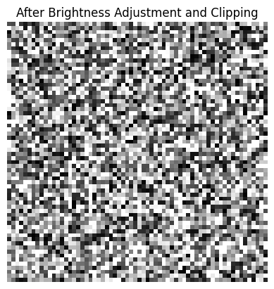

**Purpose:**

* Demonstrates global intensity manipulation.
* Introduces the concept of valid pixel ranges.

**Industry Perspective:**
Brightness correction is commonly used in photography software, surveillance systems, and preprocessing pipelines where images are captured under varying lighting conditions.

---

### 3. Contrast Stretching (Min-Max Normalization)

Pixel values were normalized to fully utilize the available intensity range.

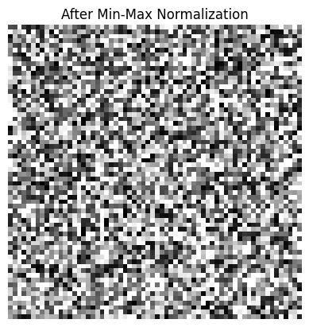

**Purpose:**

* Improves visibility of details.
* Introduces normalization techniques.

**Industry Perspective:**
Contrast enhancement is frequently used in medical imaging, satellite imagery, OCR systems, and machine learning pipelines to improve feature visibility before analysis.

---

### 4. Mean Blur (3×3 Sliding Window)

A blur filter was implemented manually using a sliding window approach.

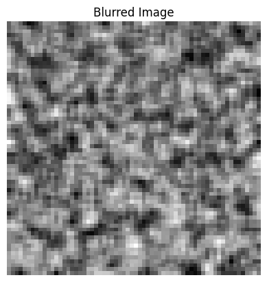

**Purpose:**

* Introduces neighborhood-based image processing.
* Demonstrates how local pixel regions influence output values.

**Industry Perspective:**
Blurring is commonly used for noise reduction and image smoothing. Although production systems often use more sophisticated filters such as Gaussian blur, the underlying idea of applying a local kernel over an image remains the same.

This task also provides intuition for convolution operations used in deep learning and computer vision.

---

### 5. Edge Detection Using Image Gradients

Horizontal and vertical intensity changes were computed and combined into an edge-strength map.

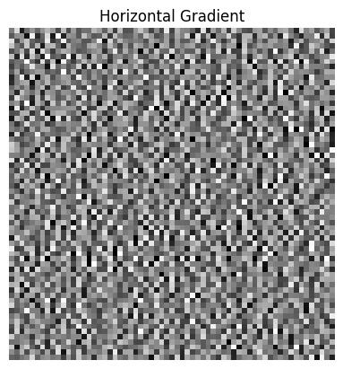

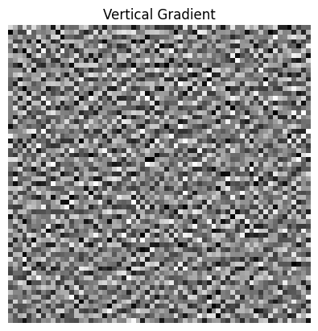

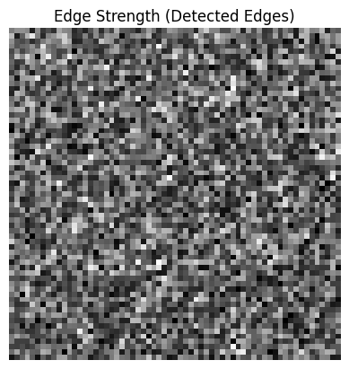

**Purpose:**

* Introduces the concept of gradients.
* Demonstrates how edges correspond to rapid intensity changes.

**Industry Perspective:**
Edge detection has historically been a fundamental computer vision technique. While modern deep learning systems often learn features automatically, gradient-based methods still appear in image analysis, robotics, document processing, and quality inspection systems.

---

### 6. Threshold Segmentation

A threshold was applied to the edge-strength map to create a binary image.

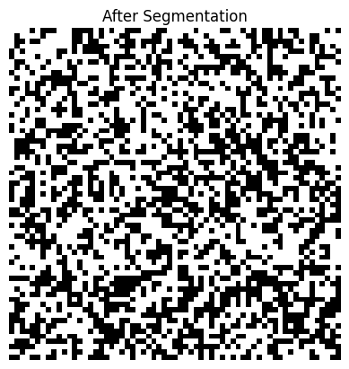

**Purpose:**

* Converts continuous measurements into discrete decisions.
* Separates "edge" and "non-edge" regions.

**Industry Perspective:**
Thresholding is one of the simplest segmentation techniques. More advanced systems use adaptive thresholding, clustering methods, or deep learning-based segmentation models, but the basic idea of separating regions based on pixel characteristics remains important.

---

### 7. Horizontal and Vertical Flipping

Images were flipped using NumPy slicing.

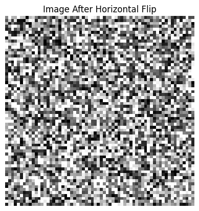

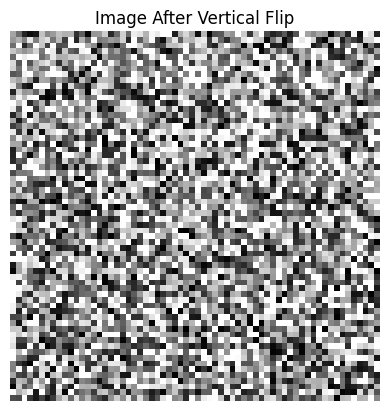

**Purpose:**

* Demonstrates geometric transformations through indexing operations.
* Builds intuition about spatial relationships in images.

**Industry Perspective:**
Image flipping is frequently used in data augmentation pipelines to increase training data diversity for machine learning and deep learning models.

---

### 8. 90-Degree Rotation

The image was rotated by 90 degrees.

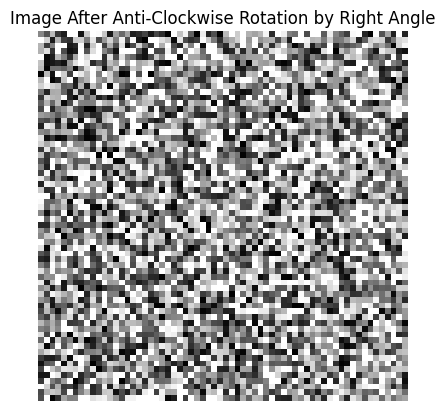

**Purpose:**

* Demonstrates coordinate transformations.
* Helps understand how image geometry can be manipulated.

**Industry Perspective:**
Rotation is another common augmentation technique. It is also useful in document processing, image alignment, and preprocessing pipelines where image orientation may vary.

---

## Key Learnings

This project provided practical experience with:

* 2D NumPy arrays as image representations
* Array slicing and indexing
* Broadcasting and element-wise operations
* Sliding-window computations
* Basic image filtering concepts
* Gradient-based feature extraction
* Threshold-based segmentation
* Geometric image transformations

More importantly, it demonstrated that many image processing operations can be expressed as mathematical transformations on arrays.

---

## Limitations

This project intentionally uses simple implementations for educational purposes.

Examples include:

* Synthetic random images instead of real photographs
* Mean blur instead of more advanced filters
* Fixed threshold segmentation
* Grayscale images only
* Loop-based implementations where optimized approaches exist

As a result, the project should be viewed as a learning exercise rather than a production-ready image processing solution.

---

## Possible Future Improvements

To move toward a more realistic image processing pipeline, future work could include:

* Processing real-world images
* Working with RGB color channels
* Implementing Gaussian blur and sharpening filters
* Exploring Sobel and Canny edge detectors
* Using adaptive thresholding techniques
* Vectorizing operations for performance
* Building reusable image processing classes/functions
* Comparing manual implementations with OpenCV equivalents
* Exploring convolution and feature extraction in deep learning models

These extensions would help bridge the gap between educational image processing exercises and practical computer vision systems.
